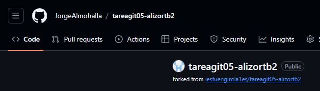
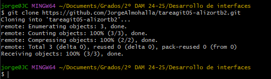
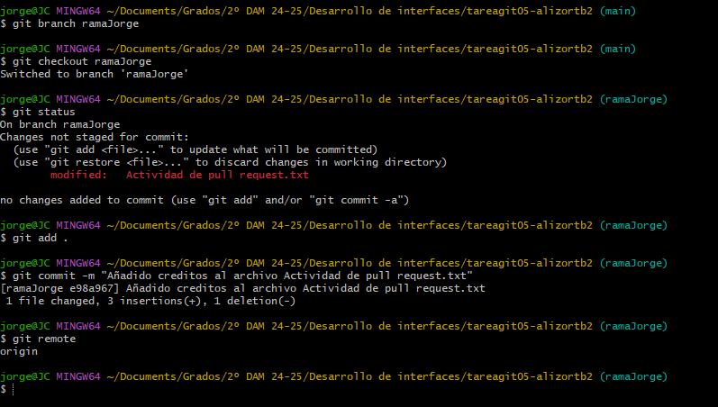
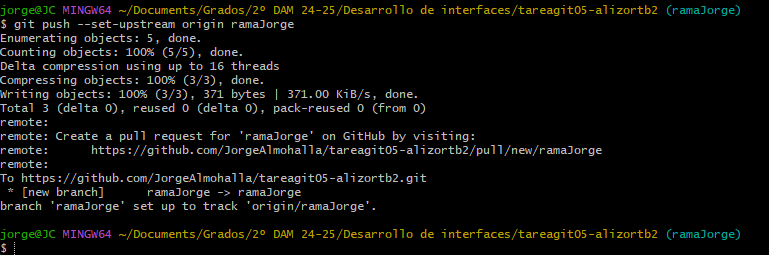
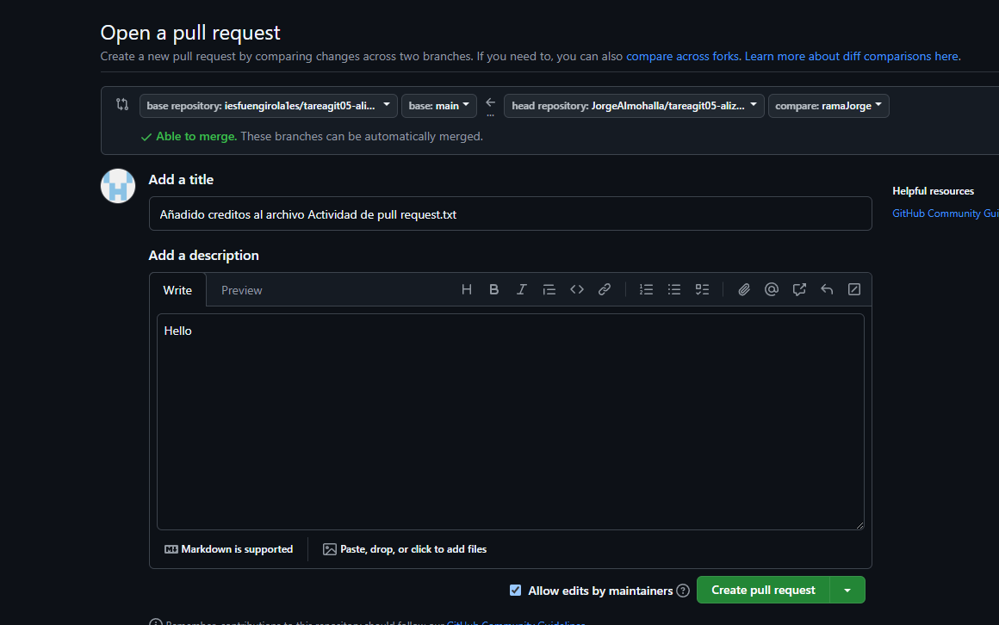
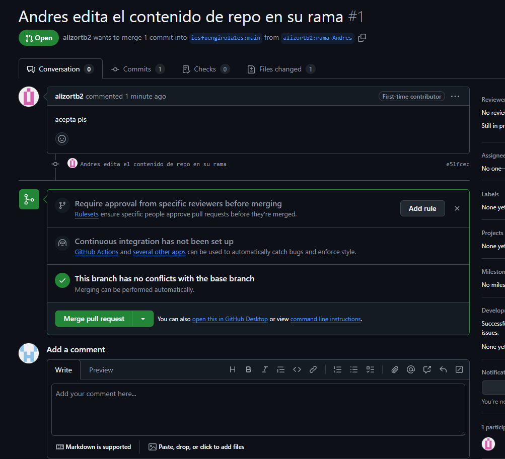

# tareagit05-JorgeAlmohalla  

## Paso 1: Realizamos un fork del repositorio en el que queremos colaborar  
  

## Paso 2: Clonamos el repositorio una vez es nuestro.  
  

## Paso 3: Creamos una rama sobre en la que hacemos cambios, luego volvemos a hacer push
  
  

## Paso 4: Creamos un pull-request.  
  

## Paso 5: Esperar a que la otra parte acepte tu pull-request.  En este caso es un ejemplo de yo aceptando la otra parte

